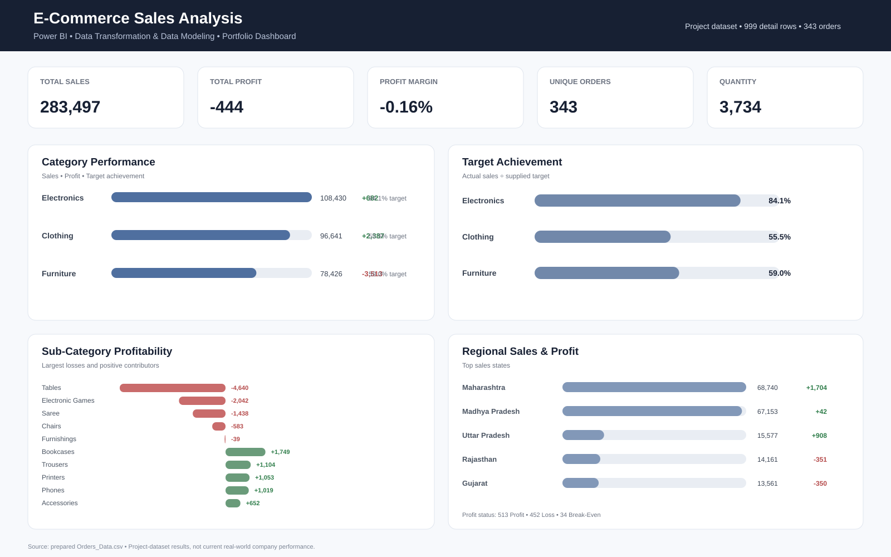

# 📊 Data Transformation & Data Modeling using Power BI

A hands-on **Power BI e-commerce sales analytics project** demonstrating an end-to-end workflow from raw business data through **Power Query transformation, data modeling, KPI reporting, target analysis, profitability analysis, and interactive dashboard development**.

> **Portfolio focus:** Data Analyst / BI Analyst skills in Power BI, Power Query, data modeling, business reporting, and analytical storytelling.

---

## 🚀 Project Highlights

**Raw Data → Power Query → Data Cleaning → Data Modeling → DAX/Analysis → Interactive Dashboard**

This project uses multiple sales-related tables to prepare a structured analytical model and turn it into a business-focused Power BI report.

### What this project demonstrates

- Multi-source data preparation
- Power Query cleaning and transformation
- Order and order-detail data integration
- Analytical summary tables
- Power BI data modeling and relationships
- KPI reporting
- Sales target analysis
- Profitability analysis
- Interactive filtering
- Business-focused dashboard design

---

## 🎯 Business Objective

The project is designed to support questions such as:

- How much revenue was generated?
- What is the overall profit and margin?
- How are categories performing?
- How close are categories to their sales targets?
- Which sub-categories generate losses or profits?
- Which states contribute the most sales?
- How is the business split between Profit, Loss, and Break-Even orders?

---

## 🧹 Data Transformation with Power Query

The data-preparation layer includes:

- Loading the source CSV files into Power BI
- Selecting the required order records
- Standardizing data types
- Cleaning and preparing customer fields
- Creating **Location = City, State**
- Creating **Profit Margin = Profit / Amount**
- Creating **Profit Status = Loss / Break-Even / Profit**
- Merging order-level and order-detail information using **Order ID**
- Preparing supporting aggregated tables for analysis

---

## 🧩 Data Model

The PBIX contains **8 analytical tables**:

| Table | Purpose |
|---|---|
| `List of Orders` | Order-level business data |
| `Order Details (1)` | Detailed order-line information |
| `Sales target (1)` | Sales target reference data |
| `Orders Data` | Prepared order dataset |
| `Monthly Sales Target` | Monthly target analysis |
| `Category Average Profit` | Category-level profit analysis |
| `Order Details Summary` | Order-detail aggregation |
| `Sub-Category Total Amount` | Sub-category aggregation |

### Model Architecture


---

## 📊 Interactive Portfolio Dashboard

The PBIX now contains a dedicated reporting page designed around common business-analysis questions.

### Dashboard sections

**KPI Cards**
- Total Sales
- Total Profit
- Profit Margin
- Total Quantity
- Unique Orders

**Business Visuals**
- Category Performance
- Sales Target Achievement
- Sub-Category Profitability
- Regional Sales & Profit
- Profit Status

**Interactive Filters**
- Category
- State

### Dashboard Preview



> The SVG above is a portfolio preview of the dashboard. The **PBIX contains the interactive report page**.

---

## 📈 Validated Project Results

Using the prepared project dataset:

| KPI | Result |
|---|---:|
| Total Sales | 283,497 |
| Total Profit | -444 |
| Profit Margin | -0.16% |
| Unique Orders | 343 |
| Quantity | 3,734 |

### Category Performance

| Category | Sales | Profit | Target Achievement |
|---|---:|---:|---:|
| Electronics | 108,430 | 682 | 84.05% |
| Clothing | 96,641 | 2,387 | 55.54% |
| Furniture | 78,426 | -3,513 | 59.01% |

### Profit Status

- **Profit:** 513
- **Loss:** 452
- **Break-Even:** 34

Detailed calculations and business observations are documented in [Business Analysis](docs/Business_Analysis.md).

---

## 🛠️ Tools & Technologies

**Power BI Desktop** • **Power Query** • **DAX** • **Data Modeling** • **Data Cleaning** • **Data Transformation** • **Business Intelligence**

---

## 📁 Repository Structure

```text
Data-Transformation-Data-Modeling-using-Power-BI/
│
├── Data Transformation & Data Modeling using Power BI.pbix
│
├── raw-data/
│   ├── List_of_Orders.csv
│   ├── Order_Details.csv
│   └── Sales_Target.csv
│
├── cleaned-data/
│   ├── Cleaned_List_of_Orders.csv
│   ├── Cleaned_Order_Details.csv
│   ├── Cleaned_Sales_Target.csv
│   └── Orders_Data.csv
│
├── images/
│   ├── Business_Dashboard.svg
│   └── data-model-architecture.svg
│
├── docs/
│   ├── Data_Model_Documentation.md
│   ├── DATA_CLEANING_REPORT.md
│   └── Business_Analysis.md
│
└── README.md
```

---

## 🔍 How to Explore

### 1. Download the PBIX

Download **Data Transformation & Data Modeling using Power BI.pbix**.

### 2. Open in Power BI Desktop

Open the PBIX in Power BI Desktop.

### 3. Review the transformation layer

Open **Transform Data** to inspect the Power Query preparation steps.

### 4. Review the model

Open **Model view** to inspect the tables and relationships.

### 5. Review the dashboard

Open **Report view** to interact with the KPI cards, charts, and slicers.

---

## 📚 Documentation

- [Data Model Documentation](docs/Data_Model_Documentation.md)
- [Data Cleaning & Transformation Report](docs/DATA_CLEANING_REPORT.md)
- [Business Analysis & Validated Insights](docs/Business_Analysis.md)
- [Data Model Architecture](images/data-model-architecture.svg)

---

## 🎓 Skills Demonstrated

This project demonstrates practical experience in:

- Power Query
- Data cleaning
- Data transformation
- Data merging
- Data modeling
- KPI design
- Sales target analysis
- Profitability analysis
- Data visualization
- Business reporting
- Analytical storytelling

---

## 📌 Portfolio Value

This repository demonstrates the **data-preparation and reporting foundation of a Data Analyst workflow**.

It can be reviewed alongside my other projects covering:

- Dashboard development
- SQL analysis
- Business analysis
- Power BI & DAX
- Data transformation and modeling

---

## 👤 About Me

**Shanmukh Koyya**  
Aspiring Data Analyst | Power BI | SQL | Excel | Python

📧 **Email:** [shanmukhkoyya1234@gmail.com](mailto:shanmukhkoyya1234@gmail.com)

💼 **LinkedIn:** [linkedin.com/in/shanmukh-koyya](https://www.linkedin.com/in/shanmukh-koyya/)

💻 **GitHub:** [github.com/shanmukhkoyya](https://github.com/shanmukhkoyya)

---

⭐ Explore the repository to review the **data, transformation logic, model structure, documentation, and interactive Power BI dashboard**.
