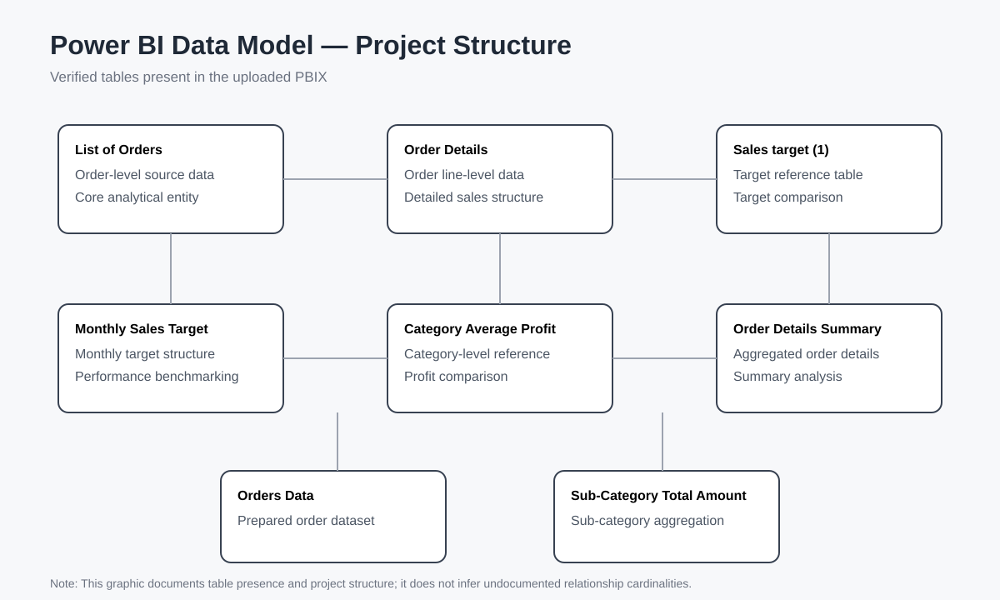

# 🔄 Data Transformation & Data Modeling using Power BI

A focused **Power BI portfolio project** demonstrating the data-preparation and modeling stages of a business analytics workflow.

## 🎯 Project Focus

This project is centered on the work that happens before a polished dashboard:

- Data transformation
- Data cleaning and preparation
- Power Query workflow
- Data modeling
- Relationship-based analysis
- Report-ready analytical structure

## 🧩 Verified PBIX Model

The uploaded PBIX contains **8 tables**:

| Table | Purpose in the project |
|---|---|
| `List of Orders` | Order-level source structure |
| `Order Details (1)` | Detailed order-line data |
| `Sales target (1)` | Sales target reference |
| `Orders Data` | Prepared order dataset |
| `Monthly Sales Target` | Monthly target analysis |
| `Category Average Profit` | Category-level profit reference |
| `Order Details Summary` | Aggregated order-detail structure |
| `Sub-Category Total Amount` | Sub-category aggregation |

> **Scope note:** The table list and model presence are verified from the PBIX. Relationship cardinalities and numerical business findings are not claimed here unless directly verified.

## 🛠️ Tools & Technologies

- Microsoft Power BI
- Power Query
- Data Transformation
- Data Modeling
- Data Visualization

## 📁 Project File

| File | Description |
|---|---|
| `Data Transformation & Data Modeling using power BI.pbix` | Power BI project file |

## 📊 Intended Reporting Layer

The model is structured to support:

- Sales KPI reporting
- Profit analysis
- Monthly sales trends
- Category and sub-category analysis
- Actual sales vs target
- Interactive business filters

## 🚀 How to Use

1. Download the PBIX file.
2. Open it with **Power BI Desktop**.
3. Review the Power Query/data-preparation layer.
4. Inspect the model and relationships.
5. Review or extend the report layer using the documented analytical structure.

## 🧠 Skills Demonstrated

- Power Query
- Data cleaning and transformation
- Data modeling
- Relationship-based analysis
- Aggregation
- Business reporting structure
- Power BI development

## 📚 Documentation

- [Data Model Documentation](docs/Data_Model_Documentation.md)
- [Data Model Structure](images/data-model-architecture.svg)

## 📌 Portfolio Position

This project complements my other analytics projects by focusing specifically on **data transformation and data modeling**, two core stages of a professional BI workflow.

## 👤 Author

**Shanmukh Koyya**

Aspiring Data Analyst | Power BI | SQL | Excel | Python
